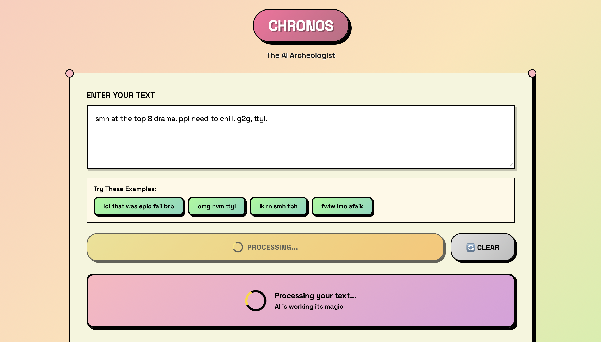
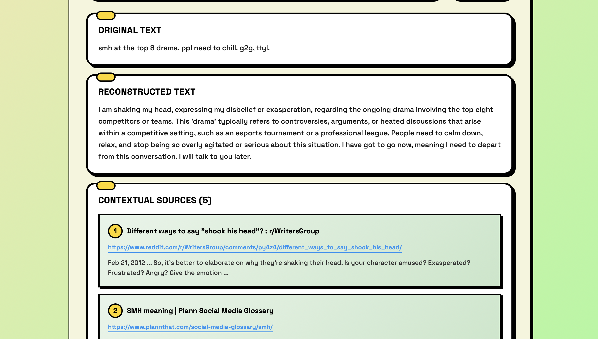
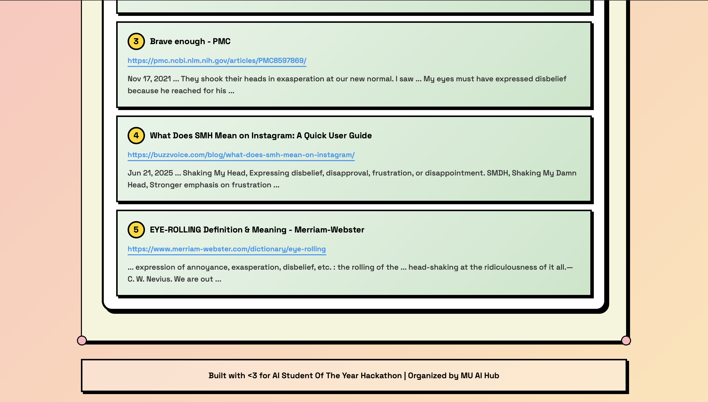

# Project Chronos: The AI Archeologist

**Student Name:** Sahasri Gundapuneedi
**Student ID:** SE23UCAM019


**Student Name:** Chirala Mohan Krishna
**Student ID:** SE23UCAM031


## Project Description

Project Chronos is a full-stack web application that functions as an "AI Archeologist." It's purpose is to take fragmented text, slang, abbreviations, or unclear expressions and use the Google Gemini AI to reconstruct them into clear, coherent language. The application then fetches relevant contextual sources from the web to provide a complete understanding of the original text's meaning and origin.

---

## Setup Instructions 

Follow these steps to set up and run the project on a new machine.

### 1. Clone the Repository

Open your terminal and run the following command to clone the project:

```bash
git clone https://github.com/saha433/chronos.git
ls chronos
cd chronos
```

## 2. Install Dependencies

This project uses Python. You must install the libraries listed in requirements.txt.
```
pip install -r requirements.txt
```

## 3. Configure API Keys

The application requires three API keys to function. You must create a .env file in the root of the project directory.

1. Create the file:
```
touch .env
```

2. Open the .env file and add your keys in the following format:
```
GEMINI_API_KEY=your_gemini_api_key_here
GOOGLE_SEARCH_API_KEY=your_google_search_api_key_here
GOOGLE_SEARCH_ENGINE_ID=your_google_search_engine_id_here
```

## How to Get Your API Keys

You need to generate three unique keys from Google's services.

### Step A: Get `GEMINI_API_KEY`

1.  Go to **Google AI Studio**.
2.  Sign in with your Google account.
3.  Click on **"Get API key"** in the top-left menu.
4.  Click **"Create API key in new project"** (or select an existing one).
5.  Your key will be generated. Copy this key and paste it into your `.env` file.

### Step B: Get `Google Search_API_KEY`

1.  Go to the **Google Cloud Console**.
2.  Select a project or create a new one.
3.  In the search bar, type **"Custom Search API"** and select it.
4.  Click **"Enable"** to activate the API for your project.
5.  Once enabled, go to the navigation menu (☰) → **"APIs & Services"** → **"Credentials"**.
6.  Click **"+ CREATE CREDENTIALS"** at the top and select **"API key"**.
7.  Your key will be created. Copy this key and paste it into your `.env` file.
    * **Important:** For security, click "Edit API key" and under "API restrictions," select "Restrict key" and choose the **"Custom Search API"**.

### Step C: Get `Google Search_ENGINE_ID`

1.  Go to the **Programmable Search Engine** control panel.
2.  Click **"Add"** to create a new search engine.
3.  In the "What to search?" section, select the option to **"Search the entire web"**.
4.  Give your search engine a name (e.g., "Chronos Search").
5.  Click **"Create"**.
6.  Once created, go to the **"Overview"** page for your new search engine.
7.  Find the **"Search engine ID"** and click the **"Copy"** button.
8.  Paste this ID into your `.env` file.

### 3. Run the Application
```bash
/usr/bin/python3 text_reconstruction_app.py
```

## File Structure

```
text-reconstruction-app/
├── text_reconstruction_app.py    # Main application
├── requirements.txt              # Python dependencies
├── .env                         # API keys (configured)
├── procfile                     # For render deployement
├── README.md                    # This documentation
├── test_app.py                  # Test script
└── text-reconstruction-app.code-workspace  # VS Code workspace
```





## Usage Guide 

This is a web application with a separate backend and frontend. You must run the backend server first, then open the frontend in your browser.

1. Run the Backend Server
In your terminal, run the following command to start the Flask server. It is configured to run on port 5001.
```
flask run --port 5001
```
You should see output indicating the server is running, such as: Running on http://127.0.0.1:5001 

2. Open the Frontend
Once the server is running, open the index.html file directly in your web browser.
The web page will load, and you can now enter text into the textbox and click "Reconstruct" to interact with your local backend.

**Input**: `"lol, that was epic fail. brb"`

**Output**:
```
================================================================================
                    TEXT RECONSTRUCTION REPORT
================================================================================

1. ORIGINAL FRAGMENT:
   "lol, that was epic fail. brb"

2. AI-RECONSTRUCTED TEXT:
   "Laughing out loud, that was a significant and embarrassing mistake or failure. 
   Be right back."

3. CONTEXTUAL SOURCES:
   1. Epic Fail - Wikipedia
      Link: https://en.wikipedia.org/wiki/Epic_fail
      Summary: Epic fail is an internet slang expression used to describe...

   2. Internet Slang Dictionary - LOL, BRB
      Link: https://www.internetslang.com/
      Summary: Comprehensive dictionary of internet slang including LOL, BRB...
```

## API Usage and Costs

### Google Gemini API
- Free tier: 60 requests per minute
- Pricing: Check [Google AI pricing](https://ai.google.dev/pricing)

### Google Custom Search API
- Free tier: 100 search queries per day
- Pricing: $5 per 1000 queries after free tier

## Error Handling

The application includes comprehensive error handling for:
- Missing API keys
- Network connectivity issues
- API rate limiting
- Invalid input text
- Search API failures

## Customization

You can customize the application by modifying:
- `num_results` parameter in `search_contextual_sources()` for more/fewer search results
- The Gemini prompt in `reconstruct_text_with_ai()` for different reconstruction styles
- Report formatting in `generate_report()` for different output formats

## Requirements

- Python 3.9+ (system Python recommended)
- Internet connection
- Valid API keys for Google Gemini and Google Custom Search

## Troubleshooting

### Common Issues

1. **"API key not found" error**
   - Ensure your `.env` file exists and contains valid API keys
   - Check that the environment variable names match exactly

2. **"Search API quota exceeded" error**
   - You've hit the daily limit for Google Custom Search API
   - Wait 24 hours or upgrade to a paid plan

3. **"Gemini API error"**
   - Check your API key is valid and has sufficient quota
   - Ensure you have internet connectivity

### Getting Help

If you encounter issues:
1. Check the error message for specific details
2. Verify your API keys are correct and active
3. Ensure all dependencies are installed
4. Check your internet connection
